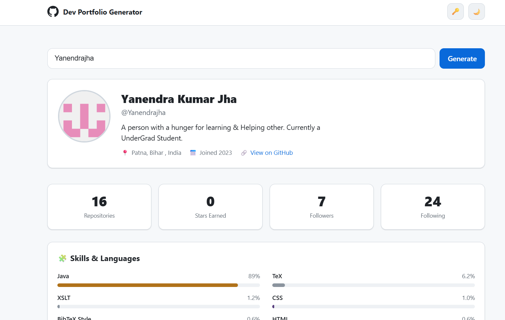

# 🧑‍💻 GitHub Dev Portfolio Generator

Enter any GitHub username and instantly generate a beautiful, shareable developer
portfolio — and export it as a recruiter-ready **one-page résumé PDF**. Built with
**vanilla HTML, CSS, and JavaScript** (Fetch API), no frameworks.

<!-- Live site, deployed on GitHub Pages -->
**🔗 Live demo:** https://nandani1512.github.io/synent-task6-APIIntegerationProject_Nandani/

Try it with a username in the URL:
[?user=torvalds](https://nandani1512.github.io/synent-task6-APIIntegerationProject_Nandani/?user=torvalds)

---

## 📸 Screenshots

> Drop your images into the `screenshots/` folder with the exact filenames below
> and they'll appear here automatically. (See **"How to capture screenshots"** at the bottom.)

### Dashboard


### Contribution heatmap & commit activity


### Light & dark themes


### One-page résumé PDF export


---

## ✨ Features

**Core**
- Live data from the **GitHub REST API** — profile, repos, languages, and public events
- **Parallel fetching** with `Promise.all` (profile + repos + events at once)
- Loading **skeletons** on every section, plus friendly **error states** (404 / rate-limit / offline) with retry
- Fully **responsive** (mobile → desktop)

**Sections**
- **Hero** — avatar, name, bio, location, join year, profile link
- **Stats bar** — repos, stars earned, followers, following, with **animated count-up**
- **Skills** — top languages auto-detected from repos, shown as **% progress bars**
- **Repositories** — cards with stars/forks/language badge; **pin/unpin** your best (saved per session)
- **Contribution heatmap** — 53×7 CSS grid with 5 intensity levels and hover tooltips
- **Streak counters** — current & longest push streaks
- **Commit activity chart** — Chart.js bar chart of pushes/day (last 30 days)
- **Activity feed** — last 10 public events with human-readable timestamps (`timeAgo`)

**Standout**
- 🌗 **Dark / light theme** toggle (CSS variables), persisted
- 🔗 **Shareable URL** — `?user=username` pre-fills and auto-generates on load
- ⏱️ **Debounced** search (300ms) + **sessionStorage caching** (repeat lookups skip the network)
- 🔑 **Optional token** support (60 → 5,000 req/hour), persisted in `localStorage`
- 📊 Live **API rate-limit** indicator from response headers
- 🖨️ **Résumé PDF export** — a dedicated one-page layout (header, summary, grouped tech stack,
  GitHub stats snapshot, language bars, mini heatmap, and your pinned projects)
- 🛡️ All user text is **sanitized** (no `innerHTML` with raw API data)

---

## 🛠️ Tech
- **Vanilla JS only** — no React/Vue/build step
- **GitHub REST API** (no auth required for public data)
- **Chart.js** (CDN) for the commit-activity chart

## 📁 Files
| File | Purpose |
|------|---------|
| `index.html` | Markup and section containers |
| `style.css`  | Layout, theme variables, skeletons, print/résumé styles |
| `script.js`  | Fetch logic, DOM rendering, résumé builder, event handlers |
| `config.local.example.js` | Template for an optional local token (copy → `config.local.js`) |

## 🧱 Build phases
Built in 5 incremental phases (one commit each):

1. **Foundation** — scaffold, GitHub fetch layer (`Promise.all`), hero, dark/light theme, debounced input, `?user=` param
2. **Stats & Skills** — animated stat cards, language detection + skill bars
3. **Repos & Caching** — repo cards, interactive pin/unpin, session caching
4. **Activity** — contribution heatmap, streaks, commit chart, activity feed
5. **Export & Polish** — share link, résumé PDF + print styles, rate-limit UI, error states

---

## ▶️ Run locally
Open `index.html` in a browser, or serve the folder:

```bash
python -m http.server 8000
# then visit http://localhost:8000
```

Try `?user=torvalds` in the URL to auto-load a profile.

## 🔑 Using a GitHub token (optional)

The token is **completely optional** — anyone can search any public profile without one.
It only raises the rate limit from **60 → 5,000 requests/hour**. A token is **never
hardcoded** in committed source. Choose either:

1. **At runtime:** click the **🔑** button, paste your token, Save. Stored in your
   browser's `localStorage` (paste once — it persists). Visitors who ever hit the
   limit can add *their own* token the same way; they never need yours.
2. **Locally, without re-typing:** copy `config.local.example.js` to `config.local.js`
   and paste your token there. `config.local.js` is in `.gitignore`, so it is **never
   committed or pushed**.

Generate a token at https://github.com/settings/tokens — **no scopes needed** (public data only).

> 🔒 **Security:** never commit a real token or paste one into a public chat/screenshot/issue.
> If a token is exposed, revoke it immediately and generate a new one.

---

## 🚀 Deployment (GitHub Pages)

This is a static site — no build step.

1. Push the repo to GitHub.
2. Repo → **Settings → Pages**.
3. **Source:** Deploy from a branch → **Branch:** `main` → **Folder:** `/ (root)` → **Save**.
4. After ~1 minute your site is live at `https://<your-username>.github.io/<repo-name>/`
   — for this project: https://nandani1512.github.io/synent-task6-APIIntegerationProject_Nandani/

HTTPS is automatic (required for the clipboard "copy link" feature). `config.local.js`
is gitignored, so your token is **not** deployed — the public site safely runs at
60/hour for anonymous visitors.

> Alternatives: drag the folder onto https://app.netlify.com/drop, or import the repo at vercel.com.

---

## ⚠️ Known limitations
- GitHub's public-events API returns only the **last ~90 days / 300 events**, so the
  heatmap and streaks reflect recent activity, not a full year.
- Language percentages are tallied from your **top 8 starred repos** (to stay within the
  rate limit); remaining repos contribute via their primary language only.
- "Total contributions in the last year" is not exposed by the public REST API (it comes
  from a private GraphQL feed), so the résumé shows streaks + recent active days instead.

---

## 📷 How to capture screenshots

1. Run the app and generate a profile (yours looks best!).
2. Capture these and save them in a `screenshots/` folder with these exact names:
   - `screenshots/dashboard.png` — top of the page (hero + stats + skills + repos)
   - `screenshots/activity.png` — the heatmap + commit chart area
   - `screenshots/themes.png` — light vs dark (or just one theme)
   - `screenshots/resume-pdf.png` — open the exported PDF and screenshot a page of it
3. On Windows: **Win + Shift + S** to snip, then save (or paste into Paint → Save As PNG).
4. Commit the folder: `git add screenshots && git commit -m "Add screenshots" && git push`.

The images above will then render on GitHub automatically.
