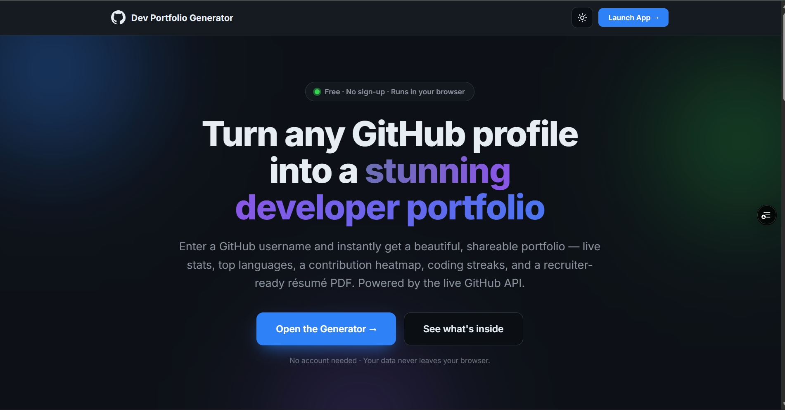
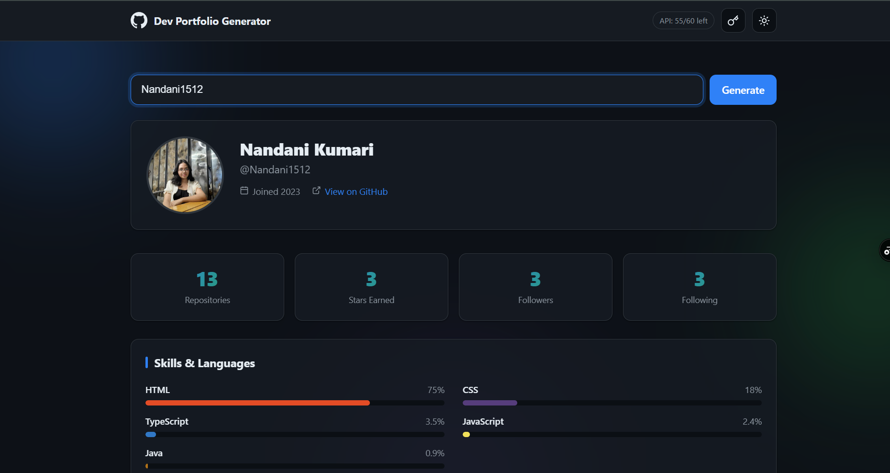
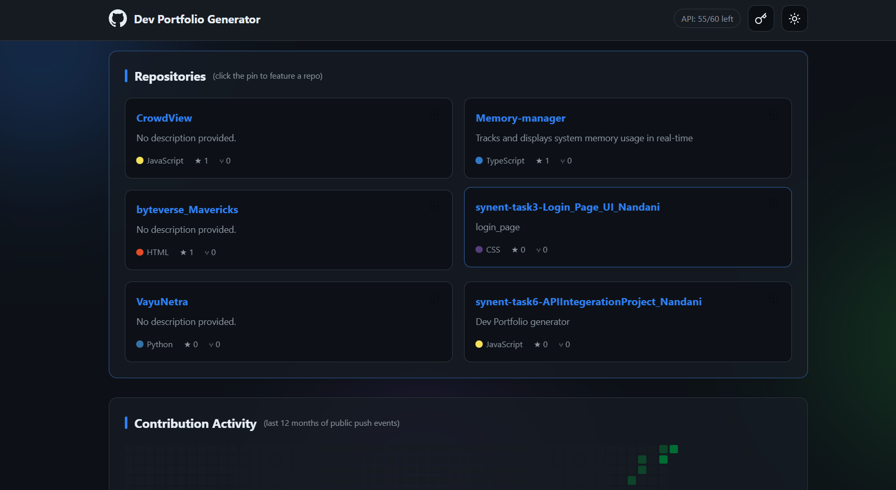
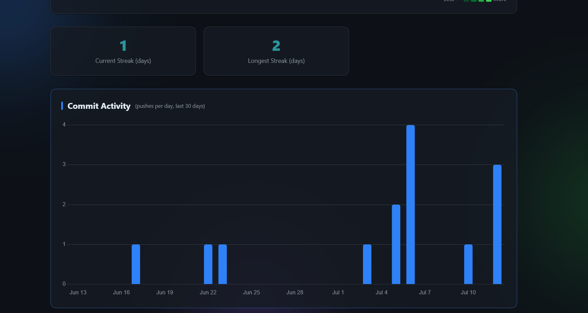
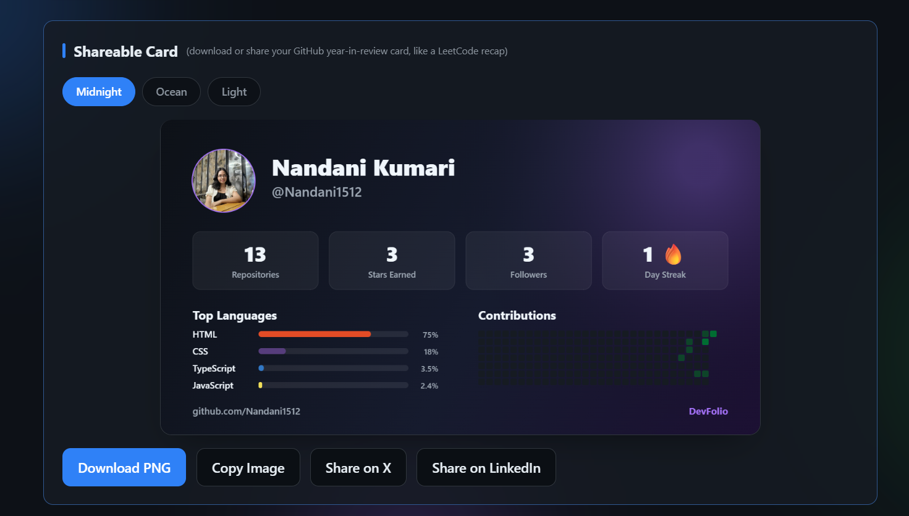
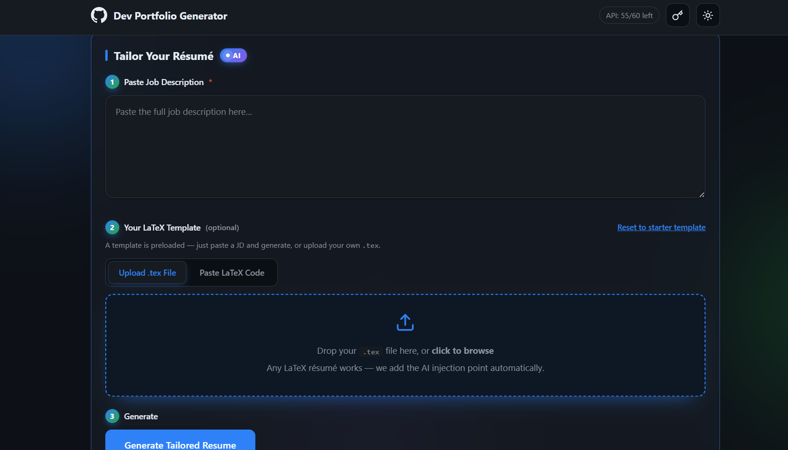

# 🧑‍💻 GitHub Dev Portfolio Generator + AI Résumé Tailor

Turn any GitHub username into a beautiful, shareable developer portfolio — live stats, skills, contribution heatmap, streaks, and a recruiter-ready résumé — then use **AI to tailor your résumé to a specific job description**, grounded only in your real repos.

Built with **Vanilla HTML/CSS/JS** on the front end and a **Node + Express + Google Gemini** service on the back end. No frameworks, no build step.

**🔗 Live Demo (Full App, including AI):** https://synent-task6-api-integeration-proje.vercel.app/

> The deployed URL serves the whole app (front end **and** the AI backend), so the résumé-tailoring features work out of the box. 

---

## 📸 Screenshots

Here are some previews of the app in action:

### Landing Page


### Portfolio Dashboard


### Developer Stats & Activity


### Projects & Pinned Repos


### AI Résumé Tailor


### AI Insights & Recommendations


---

## ✨ Features

### Portfolio (Front End, GitHub REST API)
- Live **profile, repos, languages, and public events** — fetched in parallel.
- **Stats bar** with animated count-up (repos, stars, followers, following).
- **Skills** — top languages auto-detected from repos as % bars.
- **Repositories** — cards with stars/forks/language; **pin/unpin** your best.
- **Contribution heatmap** (53×7 CSS grid, 5 intensity levels, hover tooltips).
- **Streak counters** + **commit-activity chart** + **recent activity feed**.
- **Shareable card** (PNG) and **one-page résumé** layout.
- 🌗 Dark / light **theme toggle**.
- 🔗 **Shareable URL** (`?user=`).

### AI Résumé Tailoring (Back End, Google Gemini)
- **Tailor Your Résumé** — paste a **job description**; the AI ranks your GitHub repos against it and rewrites the **Projects** region of your LaTeX résumé with ATS-optimized **X-Y-Z bullets**.
- **Bring-Your-Own-Template (BYOT)** — upload or paste your own `.tex`; the AI edits **only** the projects region and preserves your exact style.
- **Résumé Enhancement API** — a JD-driven review endpoint that returns a keyword-match score, gaps, bullet rewrites, ATS fixes, and skill suggestions.

---

## 🧱 Architecture

```
Browser (static front end)                Node + Express backend                  External
──────────────────────────                ───────────────────────────────        ──────────
index.html / app.html                      GET  /api/health                        GitHub REST API
style.css / script.js        ──fetch──▶    POST /api/resume/tailor   ──▶ Gemini ──▶ Google API
                                           POST /api/resume/enhance                (gemini-2.5-flash)
        │                                          │
        └── GitHub REST API (direct, client-side) ─┘
```

- The **portfolio** talks to the GitHub API directly from the browser.
- The **AI résumé** features call the Node backend, which securely holds the Gemini key and calls Gemini via REST.

---

## 🔌 Backend API

Base URL (deployed): `https://synent-task6-api-integeration-proje.vercel.app/`

| Method | Endpoint | Purpose |
|--------|----------|---------|
| `GET`  | `/api/health` | Liveness + config sanity (which model, whether keys are set) |
| `POST` | `/api/resume/tailor` | Tailor a LaTeX template's Projects region to a JD (BYOT) |
| `POST` | `/api/resume/enhance` | JD-driven résumé review: keyword match, gaps, bullet rewrites, ATS fixes |

---

## ▶️ Run Locally

### 1. With the AI Backend
```bash
cd backend
cp .env.example .env          # Edit .env and add your GEMINI_API_KEY
npm install
npm start                     # serves the app + API at http://localhost:3000
```
Now open `http://localhost:3000` — the whole app (portfolio + AI résumé) runs from one server.

### Environment variables (`backend/.env`)
| Var | Required | Default | Notes |
|-----|----------|---------|-------|
| `GEMINI_API_KEY` | ✅ | — | Server-side only. Get one at Google AI Studio |
| `GEMINI_MODEL` | — | `gemini-2.5-flash` | Any model your key can access |
| `GITHUB_TOKEN` | — | _(unauth)_ | Raises the server's GitHub limit (60 → 5,000/hr) |

---

## 🚀 Deployment

The backend and frontend are built to be easily deployed on services like Render, Vercel, or GitHub Pages. The current live instance is running on Vercel at `https://synent-task6-api-integeration-proje.vercel.app/`.

---

Built by **Nandani** · GitHub REST API · Google Gemini · Node/Express · Vanilla JS
